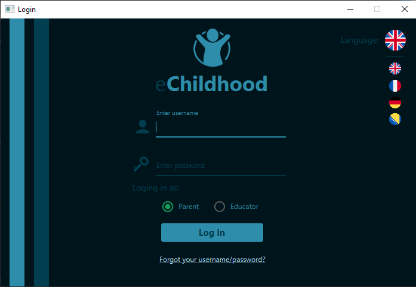

<!-- PROJECT LOGO -->
 

  

  <h3 align="center">eChildhood</h3>

<!-- ABOUT THE PROJECTt --> 
## About The Project

Desktop application intended for kindergarten educators and parents of children.

Users in every moment can see what is daily activity for children, meals for that day etc.

Layouts built from 0 with CSS and FXML files provides nice user interface.

Backend of application connected to SQLite database allows authentication and authorization for educators and parents.   

Application has internationalization feature that supports 4 different languages.

In addition, project contains work with Giphy API for searching user avatar also Mail API which activates when user forgot their password.
  
### Built With

This section is list of languages and frameworks that project uses:
* [Java]()
    * [JavaFX]()
    * [Scene Builder]()
* [CSS]()
* [SQLite]()
    